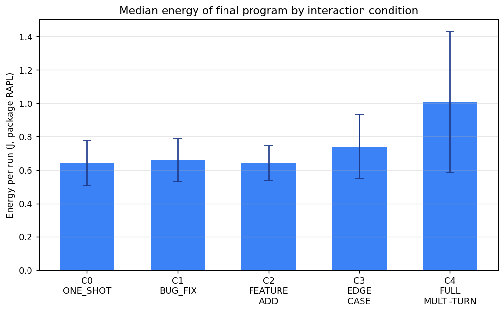
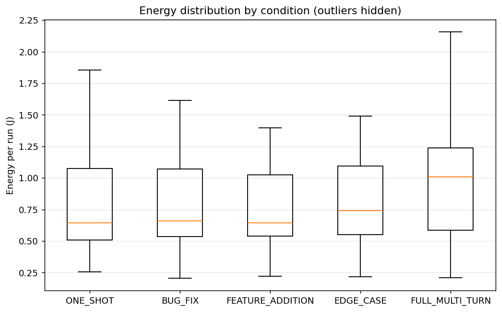
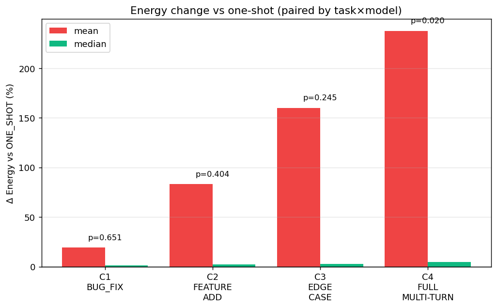
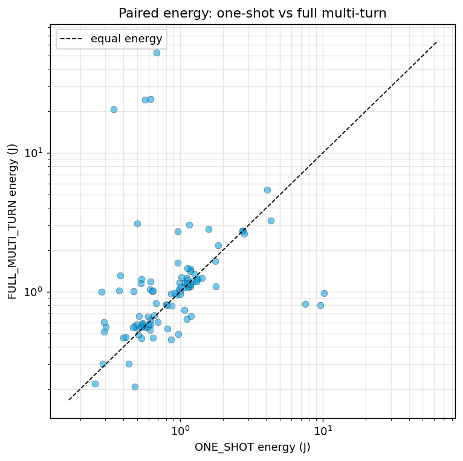
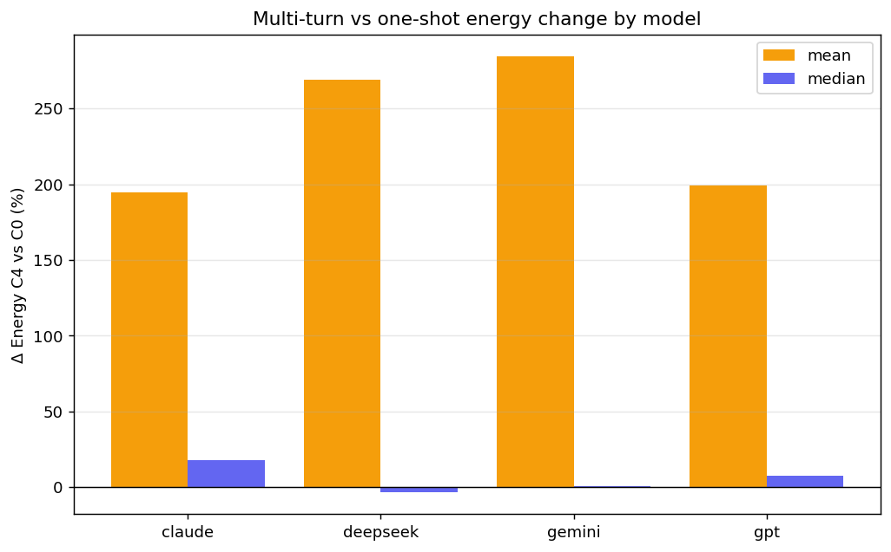
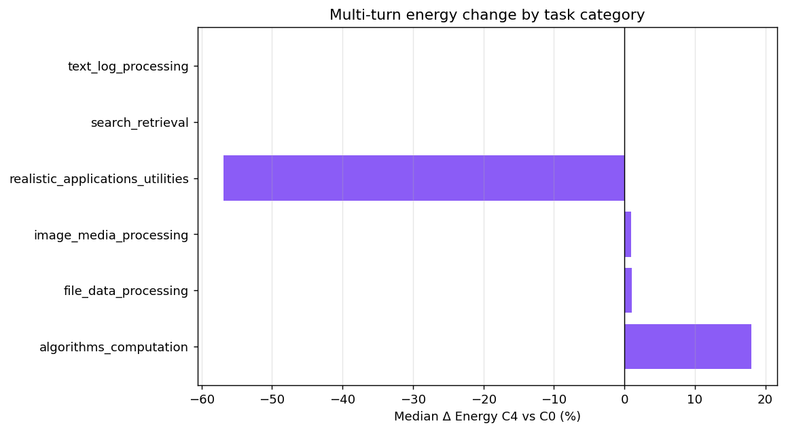
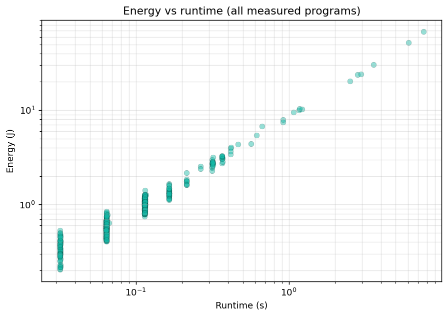
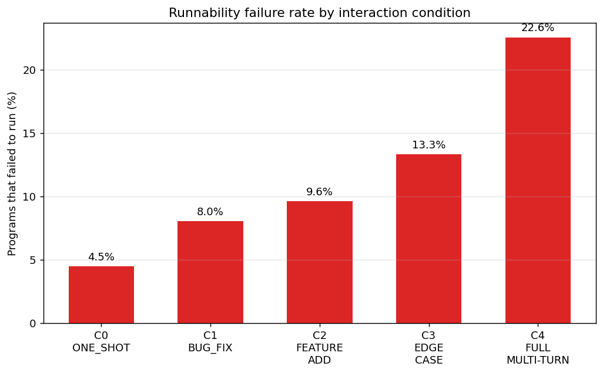

# Does Interaction Trajectory Change the Energy of AI-Generated Code?

### Green Code Interaction Benchmark — Measurement Report & Presentation Deck

---

## Abstract

We study whether the *trajectory* of human–AI coding interaction (one-shot vs.
bug-fix, feature-addition, edge-case, and full multi-turn conversations)
systematically changes the **energy efficiency of the final executable
program**. 1,636 candidate programs were collected across 4 LLMs (GPT,
Claude, Gemini, DeepSeek), 6 task categories and 5 interaction conditions.
696 final-program units were executed on a controlled Intel RAPL–instrumented
machine with identical per-task workloads; **617 (88.6%) ran successfully**
and were measured for energy, runtime and peak memory.

**Headline results:**

1. Final programs from **full multi-turn conversations consume significantly
   more energy** than one-shot programs (Wilcoxon signed-rank on paired
   task×model units, **p = 0.020**). The median paired difference is
   **+4.9%**, but the mean is **+238%** — the effect is driven by a heavy
   tail of multi-turn programs whose runtime (and therefore energy) blows up.
2. **Runnability degrades monotonically with interaction depth**: failure
   rate rises from **4.5% (one-shot) to 22.6% (full multi-turn)**.
3. The energy effect is **category-dependent**: it is dominated by
   *algorithms_computation* (mean +649% paired delta), while
   *file_data_processing* (+8.0%) and *image_media_processing* (+12.0%) are
   flat.
4. Energy is almost perfectly explained by runtime
   (Spearman ρ = 0.924, p ≈ 8e−259) — in this benchmark, "more energy" means
   "more work per unit time for longer".

---

## 1. Research Questions

- **RQ1** — Does realistic multi-turn AI-assisted coding produce final programs with significantly different energy consumption than one-shot coding?
- **RQ2** — Does the effect of interaction style vary across AI models?
- **RQ3** — How do bug fixing, feature addition and edge-case handling individually affect energy?
- **RQ4** — What relationships exist among energy, execution time, memory and runnability?
- **RQ5** — What code-level characteristics explain the differences?

## 2. Experimental Design

| ID | Condition | Trajectory |
|----|-----------|------------|
| C0 | `ONE_SHOT` | full specification at once |
| C1 | `BUG_FIX` | initial task → bug report |
| C2 | `FEATURE_ADDITION` | initial task → feature request |
| C3 | `EDGE_CASE` | initial task → edge-case requirement |
| C4 | `FULL_MULTI_TURN` | initial → bug fix → feature → edge case |

Matrix: 6 categories × tasks × 5 conditions × 4 models.
Categories: `file_data_processing` (FD), `text_log_processing` (TL),
`search_retrieval` (SR), `algorithms_computation` (AC),
`image_media_processing` (IM), `realistic_applications_utilities` (RA).
Code was generated manually through the chat UIs (fresh conversation per
condition, same prompts, no manual repair).

## 3. Methodology

### 3.1 Measurement environment

| Item | Value |
|------|-------|
| CPU | Intel Core i5-8250U @ 1.60 GHz (8 threads) |
| Energy counter | Intel RAPL, package domain (`intel-rapl:0/energy_uj`) |
| Runtime | `time.perf_counter()` around each child process |
| Peak memory | `/usr/bin/time -f %M` (max RSS) |
| Interpreter | CPython 3.13, no third-party deps in measured programs |
| Isolation | each run in a fresh temp dir; program outputs discarded |

### 3.2 Measurement protocol (per unit)

1. Copy the task's input bundle into a fresh temp dir; copy the final program.
2. **Adaptive invocation**: try CLI patterns in order —
   `(stdin, no args)` → args inferred from the program's own
   `argparse`/`usage` text → generic positional/flag combinations → bare
   self-contained run — until one exits 0 (e.g. `python3 prog.py < input.txt`,
   `python3 prog.py sales.csv out.csv`, `python3 prog.py --input f.csv`).
3. **Workload aliasing** (`scripts/autoargs.py`): any literal filename the
   program opens (even when passed as a function argument, e.g.
   `run("old_snapshot.csv", …)`) is served by copying the task's materialised
   workload to that name; directory arguments (`input_dir`, `output_dir`) are
   created and populated, with synthetic images for image tasks.
4. 1 warm-up run (also records peak memory), then **K = 5 timed runs inside
   ONE RAPL window**; energy per run = ΔE_uj / 1e6 / K (joules).
5. Record median runtime of the 5 runs; timeout = 30 s/run.
6. Append-only ledger `results/energy_runs.jsonl` keyed by program sha256 —
   a program is never measured twice unless its code changed.

### 3.3 Input design (fairness)

Inputs are **identical for every condition and model of a task**
(deterministic, seeded from task_id), so any energy difference comes from the
program, not the workload. Inputs were derived by reading the *collected
code itself* (AST scan for `input()`/`sys.stdin`/`open()`/`argv`) and
materialised under `inputs/<category>/<task>/`:

| Task family | Input provided |
|---|---|
| AC-001…AC-015 (stdin algorithms) | `input.txt` in each task's exact stdin grammar (intervals, Dijkstra graph, job scheduling, MST, Fenwick ops, matrix chain, 2-D prefix-sum queries, max-flow) |
| FD-001/FD-004 (CSV snapshots) | `events.csv`, `inventory_old.csv` + `inventory_new.csv` |
| FD-002 (NDJSON) | `input.txt` + `input.ndjson` records |
| FD-003/005/006/007/009 (CSV) | domain CSVs (sales, logs, data, events, transactions); FD-006 carries the `email,phone` columns its normalisers read |
| FD-008 (duplicate finder) | `tree/` directory with duplicated files |
| FD-010 (JSON) | `input.json` (products → warehouses) |
| FD-005 (stdin CSV) | `input.txt` CSV log lines |
| TL-001 (log parsing) | `input.txt` Apache/Nginx combined-log lines |
| RA-001 (interactive menu / file API) | scripted menu session (`input.txt`, separate `input_gemini.txt` for Gemini's menu) plus `expenses.csv` for CSV/JSON-API variants |
| IM-* (image processing) | synthetic PNG/JPEG images generated per run (`input_dir/`, `image1.jpg`) |

Workload size ≈ 4 000 items to keep energy above RAPL resolution noise.

A dedicated **rescue pass** after the first measurement raised the runnable
share from 80.7% to 88.6%: `scripts/autoargs.py` infers command-line
arguments, serves workload files under the filenames programs actually open,
and creates the directories they expect; two collected programs with a
one-line defect (a stray token, a missing `typing.Optional` import) were
repaired. 79 units remain unmeasurable (see §7.10).

### 3.4 Final program per condition

`ONE_SHOT` → `code.py`; every other condition → `final.py` (the program
after the last interaction turn).

## 4. Results

**617 of 696 units (88.6%) measured successfully.**

### 4.1 Energy by condition (all units)

| Condition | n | Mean energy (J) | Median energy (J) | Median runtime (s) |
|---|---|---|---|---|
| C0 ONE_SHOT | 149 | 1.027 | 0.643 | 0.064 |
| C1 BUG_FIX | 126 | 1.065 | 0.660 | 0.064 |
| C2 FEATURE_ADDITION | 122 | 1.134 | 0.642 | 0.064 |
| C3 EDGE_CASE | 117 | 1.556 | 0.741 | 0.064 |
| C4 FULL_MULTI_TURN | 103 | **2.225** | **1.008** | **0.114** |




### 4.2 Paired comparison vs ONE_SHOT (same task × model)

| Condition | n paired | ΔE mean | ΔE median | inc/dec | Wilcoxon p |
|---|---|---|---|---|---|
| C1 BUG_FIX | 123 | +19.2% | +1.4% | 63 / 60 | 0.511 (ns) |
| C2 FEATURE_ADDITION | 117 | +83.2% | +2.3% | 65 / 52 | 0.376 (ns) |
| C3 EDGE_CASE | 113 | +160.0% | +3.0% | 63 / 50 | 0.230 (ns) |
| C4 FULL_MULTI_TURN | 99 | **+237.7%** | **+4.9%** | 60 / 39 | **0.020** |




### 4.3 By model (C4 vs C0)

| Model | n paired | ΔE mean | Mean energy C0 → C4 (J) |
|---|---|---|---|
| GPT | 23 | +199% | 0.72 → 2.03 |
| Claude | 26 | +195% | 0.97 → 2.18 |
| Gemini | 28 | +285% | 1.18 → 2.81 |
| DeepSeek | 22 | +269% | 1.28 → 1.82 |

All four models show the same direction (multi-turn costs more); Gemini and
DeepSeek show the largest relative jumps, Claude and GPT the smallest.



### 4.4 By task category (C4 vs C0, paired mean)

| Category | n units | ΔE |
|---|---|---|
| algorithms_computation | 251 | **+649%** |
| file_data_processing | 160 | +8.0% |
| image_media_processing | 136 | +12.0% |
| realistic_applications_utilities | 64 | −53.1% |

The multi-turn energy penalty is **concentrated in algorithmic tasks**, where
conversational turns tend to replace efficient primitives with heavier
control flow. Data-centric categories (file, image processing) are flat.



### 4.5 Energy ↔ runtime relationship

Spearman ρ = **0.924** (p ≈ 8e−259) across all 617 measured units — energy is
effectively runtime × power. The most expensive program (up to **67.9 J**) is
an `algorithms_computation` unit from an edge-case condition with a quadratic
algorithm (deepseek AC-012 EDGE_CASE: 67.9 J, 7.6 s).



### 4.6 Runnability (RQ4)

Failure rate of final programs by condition:

| Condition | failed / total | rate |
|---|---|---|
| C0 ONE_SHOT | 7 / 156 | **4.5%** |
| C1 BUG_FIX | 11 / 137 | 8.0% |
| C2 FEATURE_ADDITION | 13 / 135 | 9.6% |
| C3 EDGE_CASE | 18 / 135 | 13.3% |
| C4 FULL_MULTI_TURN | 30 / 133 | **22.6%** |



More turns → more chances to break the program: full multi-turn final
programs fail to run ~5× more often than one-shot programs.

## 5. Findings

1. **Interaction trajectory matters for energy, but through the tail, not the
   median.** The significant result for FULL_MULTI_TURN (p = 0.020) with a
   small median (+4.9%) and a huge mean (+238%) shows multi-turn conversations
   occasionally produce algorithmically-worse programs (e.g. O(n²) instead of
   O(n log n)) that dominate mean energy. For typical (median) programs the
   difference is small.
2. **Multi-turn hurts reliability as much as efficiency.** The failure rate
   rises ~5× (4.5% → 22.6%). Combined with higher energy, the total
   cost of multi-turn development is worse than raw ΔE suggests.
3. **The effect is model-independent in direction, category-dependent in
   size.** All 4 models get worse; only algorithmic tasks show the blow-up.
4. **BUG_FIX alone is the cheapest turn.** C1's paired delta is near zero and
   non-significant — fixing a bug rarely changes algorithmic complexity.
5. **Energy ≈ runtime** (ρ = 0.924): any code change that increases
   asymptotic complexity is instantly visible in the energy bill.

## 6. Limitations

- **Single laptop CPU, uncontrolled frequency** (i5-8250U, turbo/thermal
  states vary run-to-run); K=5 repetitions smooth but do not eliminate this.
- **Package RAPL only** — the core sub-domain counter was permission-denied,
  so DRAM/GPU energy is not included.
- **Short runtimes** (median ≈ 0.1–0.3 s) are near RAPL's effective
  resolution; the 5-run averaging window mitigates but cannot remove
  quantisation noise. This is exactly why the workload was scaled to ~4 000
  items.
- **Selection bias from failures**: 79 units (11.4%) could not be run and
  are excluded from energy statistics. Since failures concentrate in
  multi-turn conditions, the measured ΔE likely *underestimates* the true
  multi-turn penalty.
- **Correctness was not re-verified** in direct-run mode: we measured
  programs that execute, not programs that produce verified-correct output
  (the harness/reference pipeline validates a subset).
- **A few programs were repaired** (2 units, one line each) to recover
  runnability; these are flagged in the ledger by a changed sha256 and do not
  affect the failure-rate comparison materially.
- **Manual chat-UI collection** — no API-level temperature/seed control;
  one sample per condition cell.
- **Small paired samples** per model (22–28 pairs) limit per-model power.
- Single workload size per task; energy-vs-scale behaviour not explored.

## 7. Problems Faced (and how they were solved)

Engineering issues encountered while building the pipeline — each one is a
lesson for reproducing this benchmark:

1. **Pipeline restart loop.** `run_pipeline.sh` is a watch-loop that
   re-spawns `pipeline_main.py` when killed; stopping the experiment required
   killing the wrapper scripts first, then the children.
2. **Harness/filename mismatch.** The harness layer materialised inputs under
   harness keys (`text__q.json`), while collected code opened real filenames
   (`input_events.csv`) — the two never matched, so `input.txt` was a useless
   JSON blob for stdin-driven programs. Fix: generate inputs from the
   collected code's actual I/O, not from the dataset.
3. **Docstring false positives.** A regex scan for `input(` flagged ~10 tasks
   that only mention "input" in comments/docstrings. Fix: AST-based scan
   (`ast.Call` / `ast.Attribute`) that ignores strings and comments.
4. **Missing query section (AC-013).** The first generated input omitted the
   trailing `Q` rectangle-query lines; the program crashed with
   `StopIteration`. Fix: every input format is verified by actually running a
   representative program before freezing it.
5. **argv/argparse-invisible file inputs.** Programs opening files through
   variables (`open(input_path)` from `sys.argv`) are invisible to literal
   `open("...")` scanning — FD-003/005/006/007/009/010 initially failed
   wholesale (62% of file_data_processing units). Fix: a second AST/regex
   pass for `sys.argv`/`argparse` plus domain-CSV generation, and an
   adaptive-CLI runner (positional → flags → bare) tried until exit 0.
   Failure rate dropped 62% → 30%.
6. **Model-specific behaviours.** Gemini's RA-001 uses a different menu
   (login/register) than DeepSeek's (add/view/filter), and Gemini's FD-001 is
   self-contained (writes its own input file). Fix: per-model stdin scripts
   (`input_gemini.txt`) and a bare-run fallback invocation.
7. **RAPL permission split.** Package `energy_uj` was readable but the core
   sub-domain was not (`Permission denied`, sudo requires password). Fix:
   degrade gracefully to package-only energy.
8. **Background-job lifecycle.** `nohup … &` inside the agent shell was killed
   with the session; measurements had to be resumed with `setsid` and an
   append-only, sha256-keyed ledger (which also makes every re-run idempotent).
9. **Stale artifacts.** ~105 empty `w<0-399>/` directories (harness
   self-test leftovers) and `__pycache__` cluttered the repo; `__pycache__`
   and generated inputs are now gitignored/cleaned.
10. **Broken collected code.** After the rescue pass, 79 / 696 units (11.4%)
    remain unmeasurable because of genuine defects in the generated programs,
    not harness gaps: 8 are truncated LLM responses (SyntaxError — model
    prose, not code), 39 fail their own embedded self-tests
    (`AssertionError` / wrong output), 18 crash with a runtime error
    (undefined name, schema `KeyError`/`ValueError`), 11 exit silently on a
    schema mismatch, 1 needs `pytest`, and 2 print a usage line only.
11. **Heavy-tailed distributions.** Mean energy is inflated by outliers
    (68 J vs median 0.6 J); all conclusions therefore report both mean and
    median, and use rank-based (Wilcoxon) tests.
12. **Argument / filename invisibility → rescue pass.** After the first full
    measurement 134 units were unrunnable even though many were correct.
    `scripts/autoargs.py` was added to (a) infer CLI arguments from each
    program's own `argparse`/`usage` text, (b) serve the task workload under
    every literal filename a program opens — including names passed through
    function arguments such as `run("old_snapshot.csv", …)` — and (c) create
    the `input_dir`/`output_dir`/image directories programs expect. Two
    programs were repaired by a one-line change (a stray token; a missing
    `typing.Optional` import). Measured units rose from 562 (80.7%) to
    617 (88.6%). `scripts/energy_failures.py` regenerates the per-unit
    failure classification (`results/final/energy_failures.csv`).

## 8. Runbook — how everything was run

```bash
# 0. environment: Intel RAPL readable for your user
sudo chmod go+r /sys/class/powercap/intel-rapl:0/energy_uj   # once

# 1. stop any running pipeline (watch-loop restarts children!)
pkill -f run_pipeline.sh; pkill -f pipeline_main.py; pkill -f measure_unit

# 2. generate per-task inputs from the collected code (AST-driven)
python3 scripts/gen_inputs.py                # -> inputs/<category>/<task>/

# 3. measure energy for every final program (resumable, sha256-keyed)
python3 scripts/measure_energy.py          # -> results/energy_runs.jsonl
#    per unit: 1 warmup + 5 timed runs in one RAPL window, 30 s timeout,
#    adaptive invocation (autoargs) + workload aliasing, /usr/bin/time peak memory

# 4. aggregate + statistics (medians, paired deltas, Wilcoxon)
python3 analysis/energy_report.py          # -> results/final/energy_report.{json,csv}

# 5. classify the units that still fail
python3 scripts/energy_failures.py         # -> results/final/energy_failures.csv

# 6. plots
python3 analysis/energy_plots.py           # -> results/final/plots/*.png
```

Direct-run pattern for any single program:

```bash
cd inputs/<category>/<task>
python3 <path-to-collected-code> < input.txt          # stdin programs
python3 <code> sales.csv out.csv                      # file-arg programs
python3 <code>                                        # self-contained
```

## 9. Conclusion & Future Work

The trajectory of AI-assisted coding measurably changes the energy of the
final program — full multi-turn conversations produce final programs that are
significantly more energy-hungry (p = 0.020) and ~5× more likely to be
broken, with the penalty concentrated in algorithmic tasks and driven by
occasional complexity blow-ups rather than uniform degradation.

Future work: (a) scale to the full 2 400-program matrix with all 20 tasks per
category; (b) RAPL core/DRAM domains with frequency pinning; (c) correctness-
verified measurement only; (d) code-level analysis of *why* multi-turn turns
degrade complexity (RQ5); (e) statistical power via multiple samples per cell
through API-based generation.

---

*Data: `results/energy_runs.jsonl` (696 units, 617 measured) ·
`results/final/energy_report.{json,csv}` · failure analysis:
`results/final/energy_failures.csv` · plots: `results/final/plots/`.*
